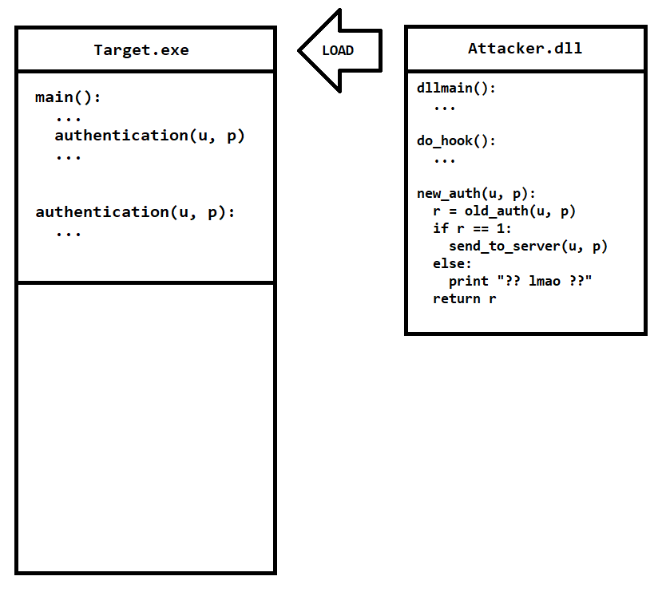

# API HOOKING	

## I. API HOOKING LÀ GÌ?

_API Hooking là một kỹ thuật mà sử dụng lệnh **JMP** hoặc **CALL** để thay đổi luồng chạy của các API. API Hooking có thể thực hiện bằng nhiều phương pháp, trong bài viết này thì chúng tôi sẽ nghiên cứu cụ thể với hệ điều hành Windows trên nền tảng 32 bit._


## II. Ý TƯỞNG	

Xét một chương trình đơn giản như sau:

```C++
#include <iostream>

int add_two_ints(int a, int b) {
	return a + b;
}

int main() {
	std::cout << add(1, 2) << std::endl;
	return 0;
}
```

Chúng ta có một hàm **add_two_ints** thực hiện tính tổng 2 tham số a, b được truyền vào. Và ở hàm **main** thực hiện call **add_two_ints** với tham số `a = 1` và `b = 2`. Sau đó in ra kết quả.

Giờ tôi sẽ chuyển nó qua mã assembly và phân tích.

```x86asm
add_two_ints proc near
push    ebp
mov     ebp, esp
mov     eax, [ebp+8] ; a
add     eax, [ebp+C] ; b
pop     ebp
retn
add_two_ints endp

_main proc near
push    ebp
mov     ebp, esp
push    offset std_end
push    2               ; b
push    1               ; a
call    add_two_ints
add     esp, 8
push    eax
mov     ecx, ds:"std::ostream std::cout"
call    ds:"std::ostream::operator<<(int)"
mov     ecx, eax
call    ds:"std::ostream::operator<<(std::ostream & (*)(std::ostream &))"
xor     eax, eax
pop     ebp
retn
_main endp
```

0. Ban đầu hãy coi stack của chúng ta đang trống rỗng | `stack = []`.

1. Bỏ qua phần header của hàm main, thì chúng ta gặp câu lệnh đầu tiên là `push offset std_end`. Lúc này object std_end sẽ được push vào stack. | `stack = [std_end]`.

2. Tương tự với 2 câu lệnh `push` phía sau, chính là push 2 tham số cho hàm `add_two_ints`. | `stack = [std_end, 2, 1]`.

3. Sau đó `call add_two_ints` được chạy để push thêm `return address` và jump đến hàm mục tiêu. | `stack = [std_end, 2, 1, main + 11 (add esp, 8)]`.

4. Đi vào hàm `add_two_ints` chúng ta gặp function header (chính là 2 dòng `push ebp` và `mov ebp, esp`) | `stack = [std_end, 2, 1, main + 11 (add esp, 8), old_ebp]`

5. Hai dòng tiếp theo thực hiện đưa giá trị của a vào eax, sau đó cộng giá trị của eax với b. Mà eax cũng là thanh ghi thường được dùng để trả về kết quả.

6. Hai dòng cuối cùng là function footer (dùng để backup lại giá trị của ebp) và câu lệnh ret dùng để nhảy về vị trí sau chỗ gọi hàm (cụ thể là giá trị tại top của stack, sau đó giá trị này bị pop). | `stack = [std_end, 2, 1]`

7. Sau khi return thì chúng ta thấy có một dòng `add esp, 8`, dòng này để dọn dẹp stack sau khi gọi hàm. esp là thanh ghi chỉ vào top của stack, add esp lên 8 đơn vị sẽ bỏ qua 8 bytes ở đầu stack và stack lúc này chỉ còn `stack = [std_end]`.

8. Những dòng sau chỉ dùng để in giá trị của eax, nên chúng ta sẽ bỏ qua...

Vậy là chúng ta đã cùng phân tích luồng chạy của chương trình này. Tiếp theo sẽ là ý tưởng thực hiện hooking, nếu giả sử hàm này là một hàm trong game đối kháng, hàm này thực hiện tính tổng của sát thương cơ bản với sát thương thêm. Sau đó trả về tổng 2 tham số này để áp dụng lượng sát thương này lên kẻ địch. Mình sẽ khai thác nó để làm cho hàm này trả về một giá trị cao hơn.

## III. TẤN CÔNG

Ý tưởng thực hiện tấn công ở đây là thay vì để hàm chạy thẳng một mạch như ban đầu, thì lúc thực hiện hàm mình sẽ bắt chương trình phải nhảy sang đoạn mã khác mà mình ghi vào ở một nơi nào đó trong bộ nhớ, ở hàm đó sẽ thực hiện trả về giá trị là a * b thay vì a + b.

Quá trình làm cụ thể sẽ như sau:

1. Tạo một vùng nhớ và để ghi code `custom_function`. Nếu là Windows thì vùng nhớ này cần có quyền `EXECUTE-READ-WRITE`.


2. Sau đó tại đầu hàm `add_two_ints` ghi đè lên đó một mã `JMP` sang `custom_function`. Hàm này sẽ tính `a * b` sau đó trả về kết quả và quay về hàm `main`.


## IV. CÁC LOẠI API HOOKING KHÁC

1. Hook Mid Function
   
   Với ví dụ bên trên là một ví dụ đơn giản để giới thiệu về API Hooking, thực tế thì khi hook chúng ta không hoàn toàn thay thế hàm cũ, mà thay vào thì sau khi `custom_function` chạy xong thì sẽ jump back về vị trí nối tiếp của hàm cũ.

	Ví dụ với một game bắn súng không ai biết đến đó là AssaultCube. Tôi tìm thấy một vị trí mà tại đó mỗi khi mình bắn súng thì đạn sẽ bị giảm đi.

	```x86asm
	...
	ac_client.exe+C73E3 - movsx ecx,word ptr [eax+48]
	ac_client.exe+C73E7 - mov eax,[esi+18]
	ac_client.exe+C73EA - mov [eax],ecx
	ac_client.exe+C73EC - mov eax,[esi+14]
	ac_client.exe+C73EF - dec [eax]					<<<<<<<<<<<<<<<<<<<<<<<<<<<<<<<< HERE
	ac_client.exe+C73F1 - lea eax,[esp+1C]
	ac_client.exe+C73F5 - push eax
	ac_client.exe+C73F6 - push ecx
	ac_client.exe+C73F7 - mov ecx,esi
	ac_client.exe+C73F9 - call ac_client.exe+C9140
	ac_client.exe+C73FE - pop edi
	ac_client.exe+C73FF - pop esi
	...
	```
	Chúng ta có thể thấy tại `ac_client.exe+C73EF` thực hiện giảm giá trị của `[eax]`, ở đấy `eax` chính là địa chỉ của vùng nhớ lưu số lượng đạn của chúng ta hiện tại. 

	Ý tưởng của tôi ở đây sẽ đặt một hook tại vị trí này để tăng giá trị của `[eax]` lên mỗi khi đạn bắn. Trong ví dụ này tôi sẽ sử dụng code `C++` để mô tả thao tác:
	
	Bước 1: Tạo một vùng nhớ để lưu đoạn mã tăng `[eax]`
	
	```C++
	// Cấp phát một vùng nhớ 1024 bytes, có quyền execute-read-write
	void * buffer = VirtualAlloc(NULL, 1024, MEM_COMMIT | MEM_RESERVE, PAGE_EXECUTE_READWRITE);

	// Ghi đoạn mã tăng eax lên một đơn vị "add [eax]", câu lệnh này chỉ mất 2 bytes và 2 bytes đó là FF 00
	// Mà một lệnh jmp cần 5 bytes, vậy nên sẽ làm mất câu lệnh "lea eax,[esp+1C]" ngay sau dec [eax]. Nên tôi sẽ đem cả 4 bytes của câu lệnh này qua buffer để hook có thể chạy mượt mà.

	unsigned char opcodes[] = {
		0xFF, 0x00,					// inc [eax]
		0x8D, 0x44, 0x24, 0x1C		// lea eax,[esp+1C]
	};
	
	memcpy(buffer, opcodes, sizeof(opcodes));

	// Sau khi có đủ đoạn mã để cheat rồi thì chúng ta cần quay về "RETURN ADDRESS" ac_client.exe+C73F5
	unsigned long return_address = ac_client + 0xC73F5;

	// Một lệnh JMP sẽ có format là E9 ?? ?? ?? ?? (4 bytes sau là relative-address)
	*(unsigned char*)(buffer + 0x6) = 0xE9;

	// Và 4 bytes sau là relative address có công thức tính là destination - source - 5
	*(unsigned long*)(buffer + 0x7) = return_address - (unsigned long)(buffer + 0x6) - 5;

	// Lúc này những gì chúng ta tạo ra sẽ trông như sau:

	/*
		...
		ac_client.exe+C73E7 - mov eax,[esi+18]
		ac_client.exe+C73EA - mov [eax],ecx
		ac_client.exe+C73EC - mov eax,[esi+14]
		ac_client.exe+C73EF - dec [eax]                 <<<<<<<<<<<<<<<<<<<< HERE
		ac_client.exe+C73F1 - lea eax,[esp+1C]
		ac_client.exe+C73F5 - push eax                  <<<<<<<<<<<<<<<<<<<#
		ac_client.exe+C73F6 - push ecx                                     #
		ac_client.exe+C73F7 - mov ecx,esi                                  #
		ac_client.exe+C73F9 - call ac_client.exe+C9140                     #
		ac_client.exe+C73FE - pop edi                                      #
		ac_client.exe+C73FF - pop esi                                      #
		...																   #
		                                                                   #
		buffer + 0			- inc [eax]                                    #
		buffer + 2			- lea eax,[esp+1C]                             #
		buffer + 6			- jmp ac_client.exe+C73F5   >>>>>>>>>>>>>>>>>>>#
	*/
	```

	Bước 2: Jmp từ vị trí cần hook qua buffer vừa tạo
	
	```C++
	// vị trí cần hook có address là ac_client.exe+C73EF
	void * hook_address = (void *)(ac_client + 0xC73EF);

	// cấp quyền được ghi vào vùng nhớ này
	unsigned long old_protect;
	VirtualProtect(hook_address, 1024, PAGE_EXECUTE_READWRITE, &old_protect);

	// thực hiện jmp đến buffer
	*(unsigned char*)(hook_address + 0) = 0xE9;
	*(unsigned long*)(hook_address + 1) = (unsigned long)buffer - (unsigned long)hook_address - 5;

	// trả lại quyền ban đầu cho vùng nhớ này
	VirtualProtect(hook_address, 1024, old_protect, NULL);

	// Tổng thể lại kết quả sẽ trông như thế này:

	/*
	    ...
	    ac_client.exe+C73E7 - mov eax,[esi+18]
	    ac_client.exe+C73EA - mov [eax],ecx
	    ac_client.exe+C73EC - mov eax,[esi+14]
	#<< ac_client.exe+C73EF - dec [eax]
	#   ac_client.exe+C73F1 - lea eax,[esp+1C]
	#   ac_client.exe+C73F5 - push eax                  <<<<<<<<<<<<<<<<<<<#
	#   ac_client.exe+C73F6 - push ecx                                     #
	#   ac_client.exe+C73F7 - mov ecx,esi                                  #
	#   ac_client.exe+C73F9 - call ac_client.exe+C9140                     #
	#   ac_client.exe+C73FE - pop edi                                      #
	#   ac_client.exe+C73FF - pop esi                                      #
	#   ...                                                                #
	#                                                                      #
	#>> buffer + 0			- inc [eax]                                    #
	    buffer + 2			- lea eax,[esp+1C]                             #
	    buffer + 6			- jmp ac_client.exe+C73F5   >>>>>>>>>>>>>>>>>>>#
	*/
	```

2. Detours
   
   Detours là một phương pháp phổ biến và tiện lợi hơn những phương pháp hooking khác. Với những phương pháp đã kể trên thì khi bạn muốn hook một hàm `custom_function` vào một hàm `target_function` nào đó. Thì code của custom_function của bạn đôi khi phải lồng thêm mã `asm` khiến code trở lên phức tạp hơn. Thay vào đó, với phương pháp detours thì bạn chỉ việc code như bình thường bằng ngôn ngữ bậc cao.

	Lần này tôi có một ví dụ như sau, một app yêu cầu bạn nhập mật khẩu để đăng nhập và sử dụng. Nếu nhập đúng thì in ra `Welcome, admin!` ngược lại sẽ in ra `Access denied!`.

	```C++
	#include <iostream>

	int authentication(std::string username, std::string password) {
		std::cout << std::endl;

		if (username == "admin" && password == "123") {
			std::cout << "Welcome, admin!" << std::endl;
			return 1;
		}
		else {
			std::cout << "Access denied!" << std::endl;
			return 0;
		}
	}

	int main() {
		std::string username;
		std::string password;

		std::cout << "Username: ";
		std::cin >> username;

		std::cout << "Password: ";
		std::cin >> password;

		authentication(username, password);

		return 0;
	}
	```

	Giờ tôi sẽ patch lại ứng dụng này, cho nó load thêm 1 dll như sau:

	```C++
	#include <iostream>
	#include <Windows.h>

	int(__cdecl* old_authentication)(std::string, std::string);

	int __cdecl new_authentication(std::string username, std::string password) {
		int result = old_authentication(username, password);
		
		if (result) {
			std::cout << "Send to server - Username: " << username << std::endl;
			std::cout << "Send to server - Password: " << password << std::endl;
		}
		else {
			std::cout << "?? quen mat khau ??" << std::endl;
		}
		
		return result;
	}

	void my_thread() {
		DWORD base = (DWORD)GetModuleHandle(NULL);
		DWORD addr = base + 0x14D0;

		DWORD old;
		VirtualProtect((void*)addr, 5, PAGE_EXECUTE_READWRITE, &old);

		BYTE* trampoline = (BYTE*)VirtualAlloc(NULL, 1024, MEM_COMMIT | MEM_RESERVE, PAGE_EXECUTE_READWRITE);
		memcpy(trampoline, (void*)addr, 5);

		*(BYTE*)(trampoline + 5) = 0xE9;
		*(DWORD*)(trampoline + 6) = (addr + 5) - ((DWORD)trampoline + 5) - 5;

		old_authentication = (int(__cdecl*)(std::string, std::string))trampoline;

		*(BYTE*)(addr) = 0xE9;
		*(DWORD*)(addr + 1) = (DWORD)new_authentication - addr - 5;
		
		VirtualProtect((void*)addr, 5, old, &old);
	}


	BOOL APIENTRY DllMain(HMODULE hModule, DWORD ul_reason_for_call, LPVOID lpReserved)
	{
		switch (ul_reason_for_call)
		{
		case DLL_PROCESS_ATTACH:
			CreateThread(0, 0, (LPTHREAD_START_ROUTINE)&my_thread, 0, 0, 0);
			break;
		case DLL_THREAD_ATTACH:
			break;
		case DLL_THREAD_DETACH:
			break;
		case DLL_PROCESS_DETACH:
			break;
		}
		return TRUE;
	}
	```

	Khi dll này được load bởi ứng dụng trên, thì nó sẽ hook vào hàm `authentication` để nhảy sang `new_authentication`. Tại `new_authentication` sẽ check kết quả sau khi kiểm tra username - password có thỏa mãn không. Nếu ổn thì sẽ gửi về server của hacker... (Ở đây mình chỉ viết cho có ví dụ chứ không thực hiện request nào gửi về server cả)

	Mô tả cách hoạt động của detours như sau:

	1. Đầu tiên chúng ta sẽ làm cho Target.exe phải load Attacker.dll, hoạt động này có thể patch lại trong file exe để nó thực hiện LoadLibrary hoặc có thể Inject dll từ bên ngoài.

		

	2. Sau khi load được một file dll, thì trong dll cũng có một hàm main (gọi là dllmain). Khi xảy ra một sự kiện nào đó như dll được load, hay dll được giải phóng đều sẽ gọi đến hàm dllmain này. Trong trường hợp này, khi dll được load thì hàm dllmain sẽ tạo một thread thực hiện công việc hook.

		do_hook tạo một vùng nhớ gọi là `trampoline`. Vùng nhớ này dùng để lưu giữ 5 bytes đầu của `authentication`. Lí do là vì tý nữa, 5 bytes đầu đó sẽ bị ghi đè để thực hiện lệnh `jmp`. Nếu không muốn bị lỗi, hay crash thì phải đem 5 bytes đầu đó qua một vùng nhớ tạm, để cho chương trình sau khi jmp mà vẫn chạy qua 5 bytes backup đó.

		

	3. Sau khi copy 5 bytes cần backup qua trampoline, thì vị trí 5 bytes đầu của `authentication` lúc này dùng để jmp tới `new_auth`. Còn bên phía trampoline sẽ phải tạo một lệnh jmp đến ngay sau vị trí vừa thực hiện jmp đến `new_auth`. Cuối cùng thì gán cho old_auth = trampoline. Vì thực tế, lúc này trampoline chính là hàm `authentication` cũ.
		
		

